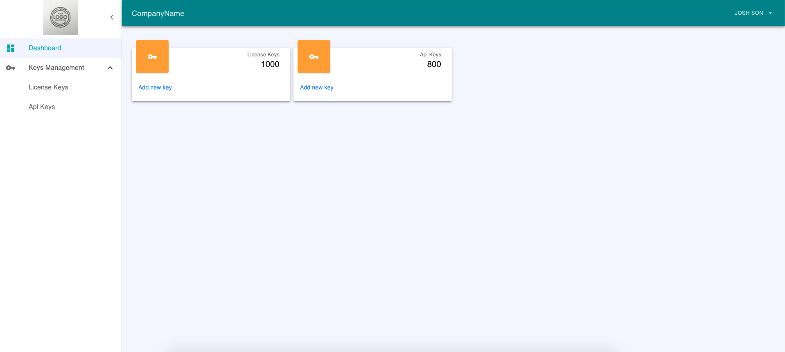

# React-MaterialUi-Admin

This project is created to make the admin dashboard easily with some fancy cards. feel free to clone and use it for free :)

## ScreenShot


## Usage

### Clone or Download Zip

```sh
$ git clone <REPO_URL> 
```

### Install Dependencies

```sh
$ npm install
```

### Run the project

```sh
$ npm start
```

## Features

- Very nice project structure
- Clean code
- Fancy Card implementation

## Authors

- [@githubprabin143](https://github.com/githubprabin143)

  
## License

[MIT](https://choosealicense.com/licenses/mit/)
